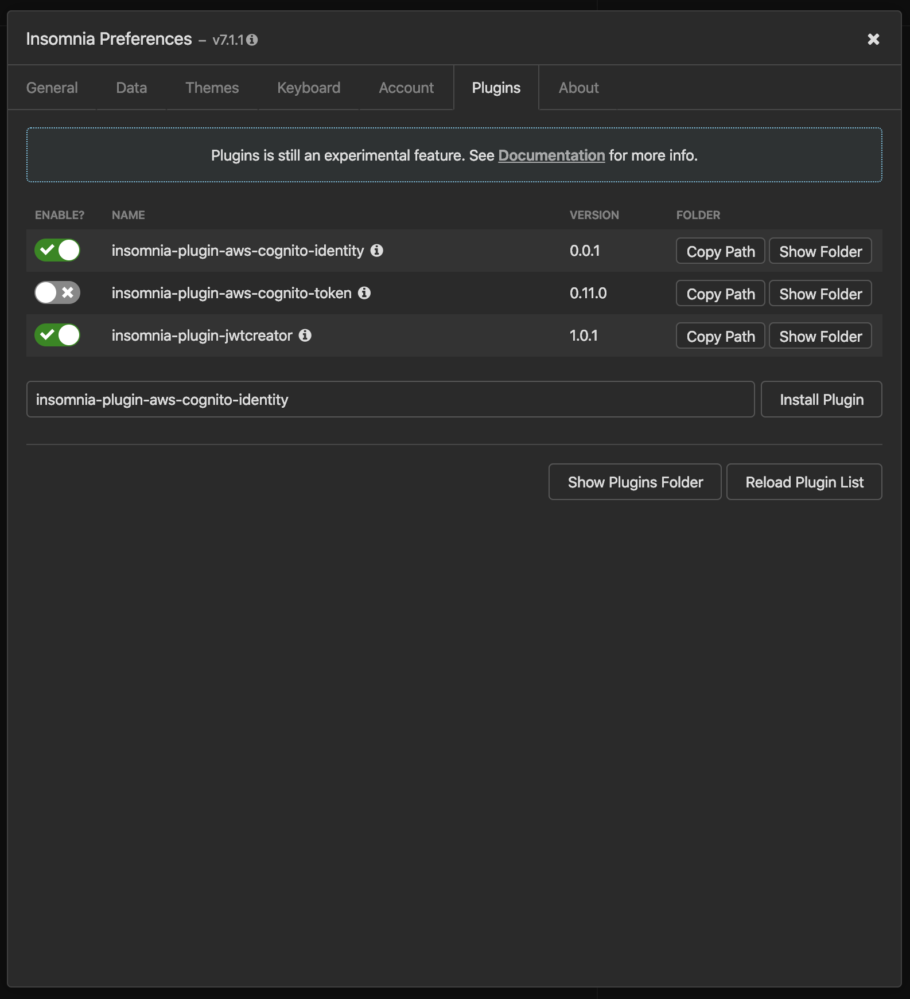
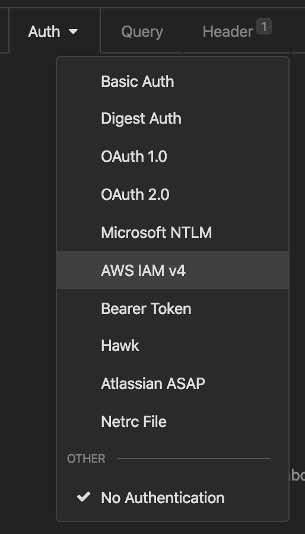
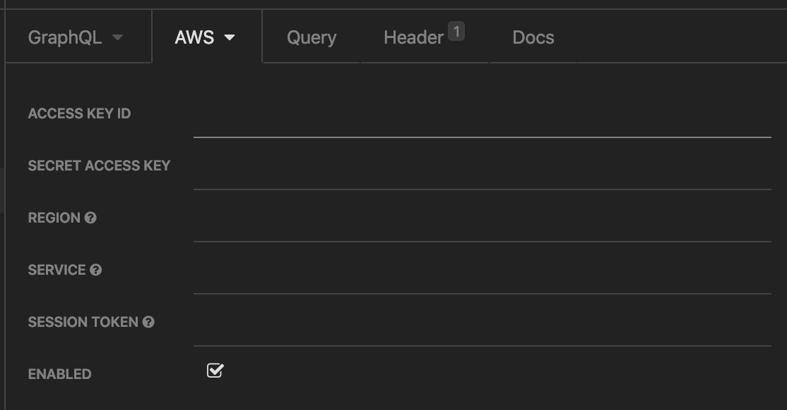
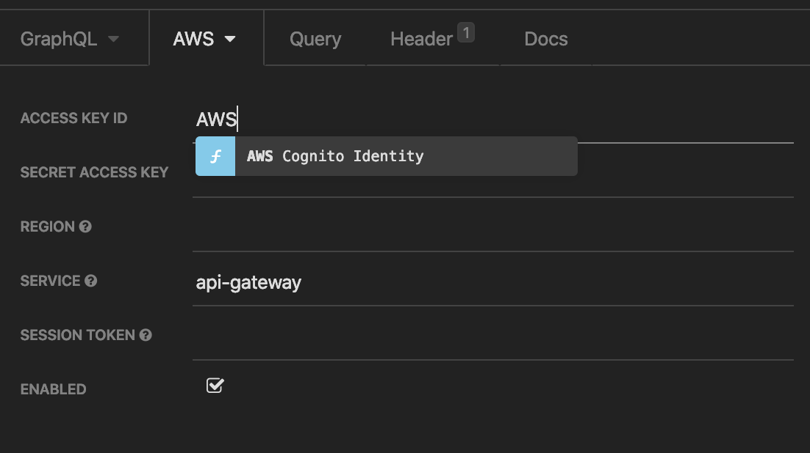
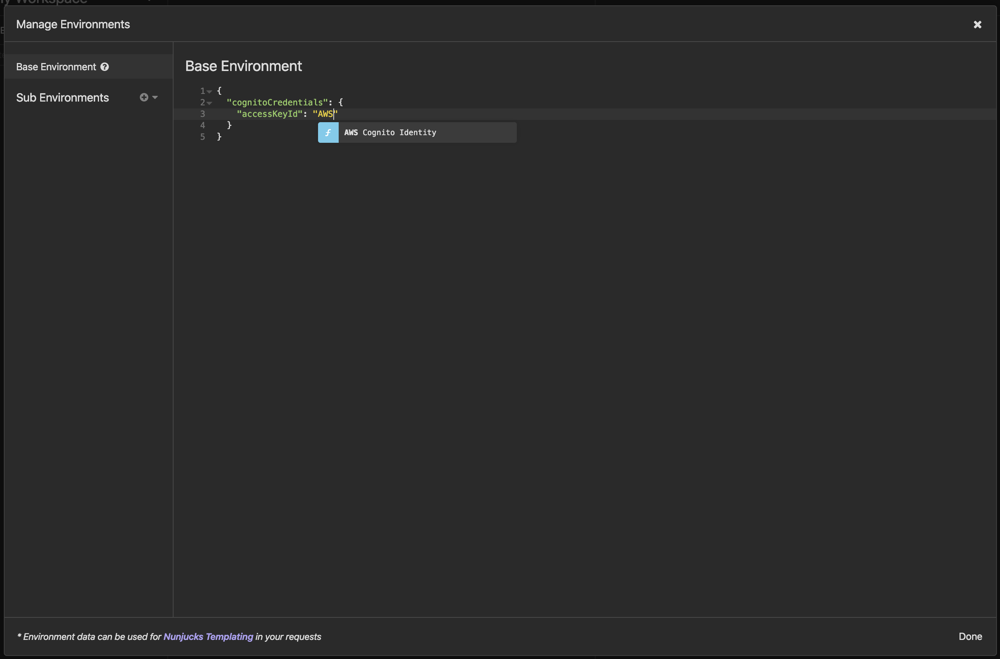
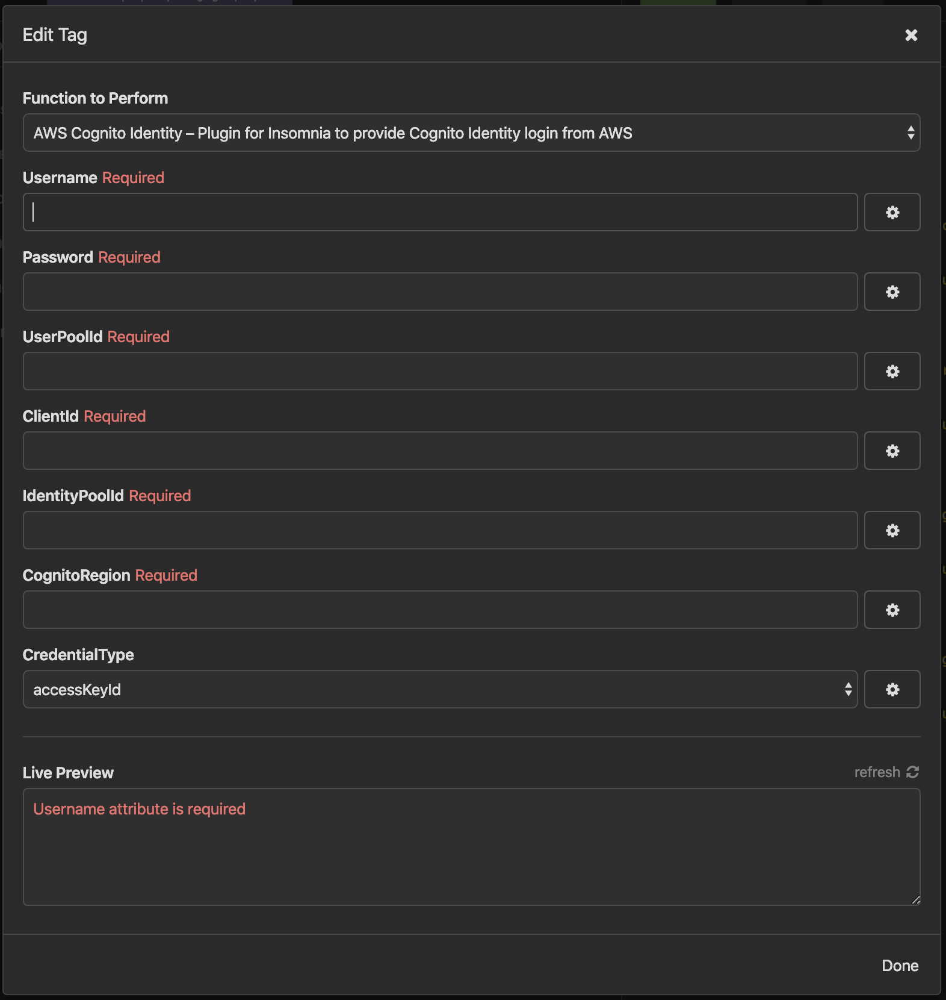

# insomnia-plugin-aws-cognito-token
Insomnia plugin for AWS Cognito Identity allowing you to generate temporary
credentials automatically and inject them into `AWS IAM v4` Auth.

## NPM
[insomnia-plugin-aws-cognito-identity](https://www.npmjs.com/package/insomnia-plugin-aws-cognito-identity)

## Insomnia
[Insomnia](https://support.insomnia.rest/) is a free cross-platform desktop application that takes the pain out of interacting with HTTP-based APIs. 

## Plugin
[Insomian Plugin API](https://support.insomnia.rest/article/26-plugins) support an Asynchronous API perfect form performing AWS Cognito Authentication before doing any request to AppSync for example

## Install the Plugin

## Usage

### AWS IAM v4 Auth

### From the environment

### Add Identity data

NOTE: Be sure to choose the correct `CredentialType` for each field.
